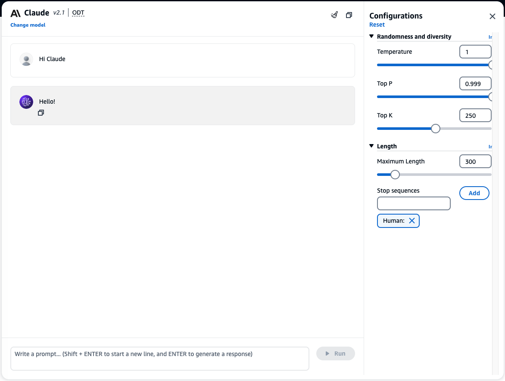
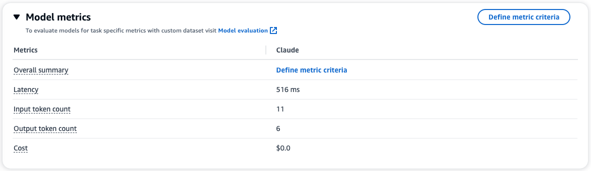
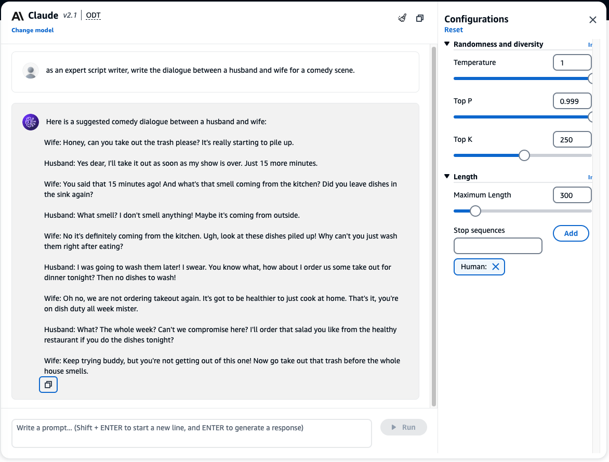
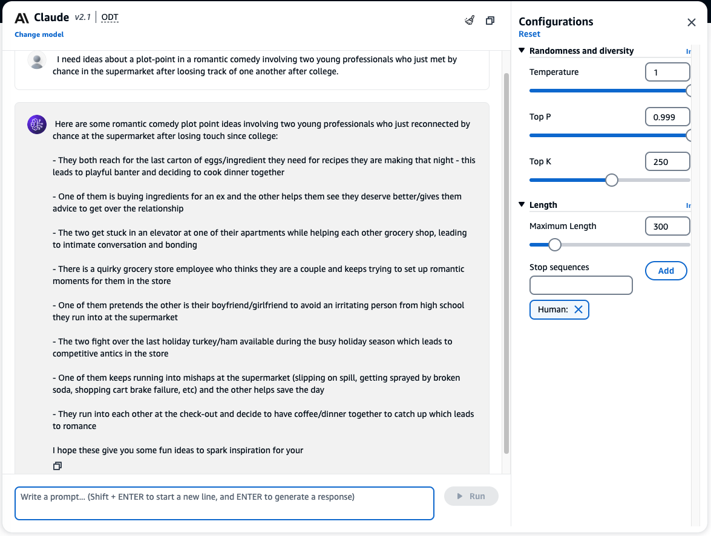
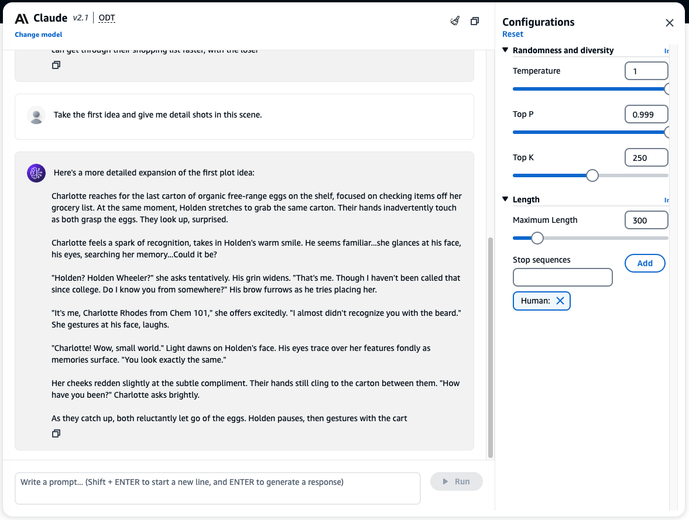

## Text Generation
---
If you are working with a script (whether for movies, television, game, etc), Foundation Models (FMs) can assist in a number of ways.

## Interact with chat models
1. This time, we are going to use the [Chat playground](https://us-west-2.console.aws.amazon.com/bedrock/home?region=us-west-2#/chat-playground). This allows you to interact with the FMs in a conversational manner.
2. Select **Claude v2.1** model.

3. Say `hello`

4. Chat playground also provide your inference metrics (latency, token count, cost, etc.).

## Create dialogue
**FMs can generate dialogues for you.** - give the model a list of characters and a brief description of the scene, and let FMs 
generate the dialogues for a Comedy.

5. Submit following prompt to Claude.

> as an expert script writer, write the dialogue between a husband and wife for a comedy scene.

6. Here is an example output. Feel free to play with the parameter to adjust the output.

> **_NOTE:_** Feel free to adjust with the prompt and configurations to refine the results

## Generate plot ideas

**FMs can also help you brainstorm for plot ideas.**

7. Ask Claude for generate some plot ides using the prompt below:

>  I need ideas about a plot-point in a romantic comedy involving two young professionals who just met by chance in the supermarket after loosing track of one another after college.

8. Don't stop there, you can ask Claude to take one of the ideas and give the shot list.

>  Take the first idea and give me detail shots in this scene.

> **_NOTE:_**  Notice the chat models are context aware.
